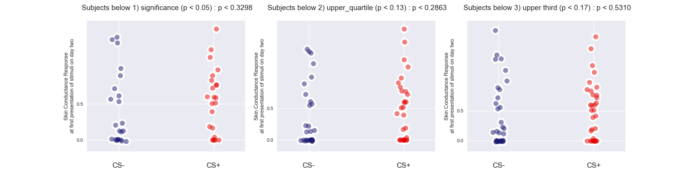
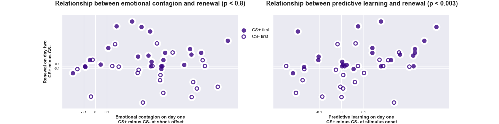
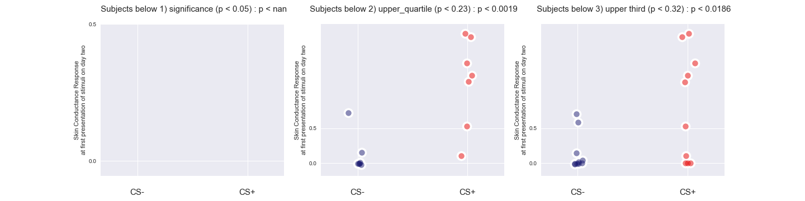
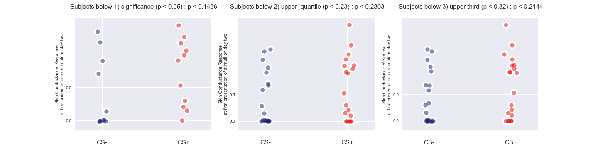
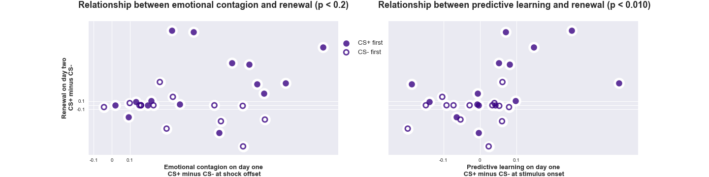
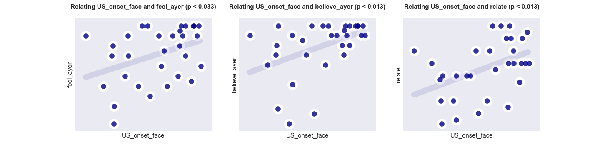

# Anaslysis and visualization scripts for study one and two

```study_one.ipynb``` contains analsysis and visualization for study one

- calls ```scr_analysis_functions_fyp``` for loading, preprocessing, and transforming scr data
- imports ```behavioral_analysis_functions``` for loading and preprocessing (trait and state) self-report data

```study_two.ipynb``` contains analysis and visualization for study two data
    
- calls ```adapting_fyp_analysis.py``` for loading, preprocessing, and transforming scr data
- imports ```gaze_analysis_objects.pkl```, gaze data that have already been preprocessed
- imports ```behavioral_analysis_objects.pkl```, self-report data (trait and state) that have - already been preprocessed

. 

. 
 
. 

### Physiological measures of predictive learning, not emotional contagion, predict renewal. 

In study one, we can look at those subjects who showed differential predictive learning on day one, scross different threshholds: 


as well as those subjects who showed differential emotional contagion on day one, at different threshholds: 



And, finally, we can show that there is a continuous relationship between predictive learning with renewal, but not emotional contagion:  



### We replicate these results in a second study, finding the same pattern of evidence.  

While there were no subjects who showed significantly differentially predictive responses to the CS+ on day one during conditioned, in this smaller cohort, looking across different statistical threshholds we observe the same pattern of evidence: predictive learning and not emotional contagion predicts renewal. 

First, we compare rates of renwal for subjects who differentially conditioned to the CS+ during conditionined via predictive learning: 



to rates of renewal for those same subjects who demonstrated dirrerential emotional contagion to CS+ on day one: 



And again, we can look at the continuous relationship between these learning measures on day one with renewal:  



#### In study two, using eye-tracking data, we can ask: How does attention predict these patterns of physiological data? 

First, we observe that looking time at faces during shock covaries with many self-report measures of interest: 



Yet this same measure does not predict our physiological measures of interest--and neither do a number of self-report measures that should, ostensibly, scale with learning about other's pain: 


There are, however, other measures that do predict renewal: the amount of pain subjects report feeling at experiencing the shock themselves (```self_pain```), trait-level personal distress (```personal_distress```) as measured by the IRI, and looking time at the model's wrist, at the time of the US (```US_onset_wrist```): 


As well as the fully covariance matrix of behavioral and physiological data: 


