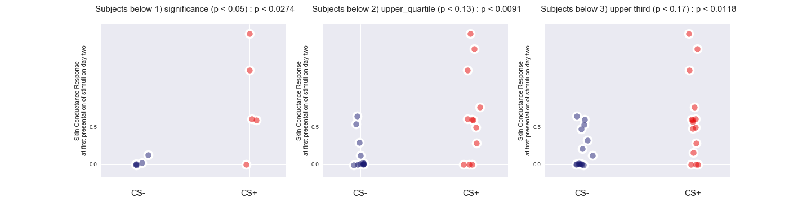
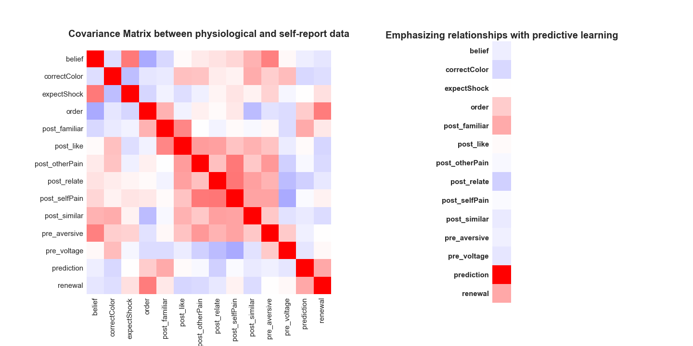
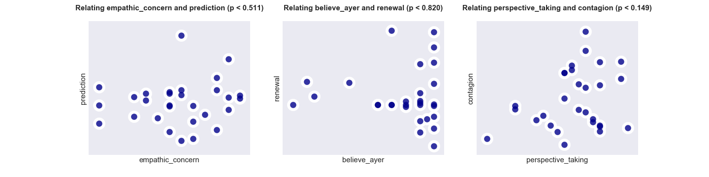

### Physiological measures of predictive learning, not emotional contagion, predict renewal. 

In study one, we can look at those subjects who showed differential predictive learning on day one, scross different threshholds: 



as well as those subjects who showed differential emotional contagion on day one, at different threshholds: 


And, finally, we can show that there is a continuous relationship between predictive learning with renewal, but not emotional contagion:  


We collected a range of state- and trait-level self-report data, but there doesn't seem to be much off-diagonal relationship between behavioral and physiological data in the full covariance matrix. 




### We replicate these results in a second study, finding the same pattern of physiological evidence, as well as attentional covariates using eye-tracking. 

While there were no subjects who showed significantly differentially predictive responses to the CS+ on day one during conditioned, in this smaller cohort, looking across different statistical threshholds we observe the same pattern of evidence: predictive learning and not emotional contagion predicts renewal. 

First, we compare rates of renwal for subjects who differentially conditioned to the CS+ during conditionined via predictive learning: 


to rates of renewal for those same subjects who demonstrated dirrerential emotional contagion to CS+ on day one: 


And again, we can look at the continuous relationship between these learning measures on day one with renewal:  


#### In study two, using eye-tracking data, we can ask: How does attention predict these patterns of physiological data? 

First, we observe that looking time at faces during shock covaries with many self-report measures of interest: 


Yet this same measure does not predict our physiological measures of interest--and neither do a number of self-report measures that should, ostensibly, scale with learning about other's pain: 




There are, however, other measures that do predict renewal: the amount of pain subjects report feeling at experiencing the shock themselves (```self_pain```), trait-level personal distress (```personal_distress```) as measured by the IRI, and looking time at the model's wrist, at the time of the US (```US_onset_wrist```): 


