# social\_structure\_learning

Humans and other animals are able to learn from our own experiences, as well as the experiences of others.

## study one: psychological and physiological on responses day one

Subjects differentially respond to a social "unconditioned stimulus" (US), operationalized as a demonstrator's expression of pain. This expression encompasses facial as well as bodily responses to an electrical shock. We operationalize subjects' response by measuring Skin Conductance Responses (SCRs). 

<p align="center">
  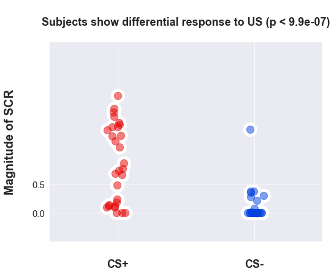
</p>

The self-reported pain (`post_selfPain`) that subjects experienced while watching the demonstrator throughout the experiment covaries with other phychological measures of interst: the amount of pain subjects thought the demonstrator felt (`post_otherPain`), the degree to which subject's felt like they could relate to the demonstrator (`post_relate`), as well as the degree to which subjects felt that they were similar to the demonstrator (`post_similar`).

<p align="center">
  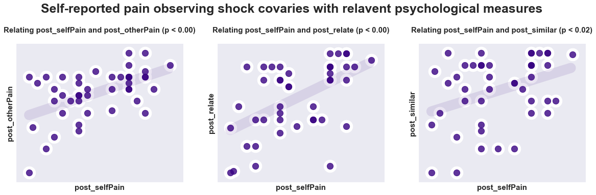
</p>

There were also significant relationships between how aversive subjects rated a personal experience with an electrical shock (`pre_aversive`) with subjective reports of pain for both themselves (`post_selfPain`) and the demonstrator (`post_otherPain`) during conditioning. There was also a significant relationship between the voltage that subjects chose to administer to themselves (`pre_voltage`) with how much pain they reported experience while watching the demonstrator (`post_selfPain`); interestingly, this was an inverse relationship such that subjects who self-administered shock at a lower voltage reported feeling greater pain observing the demonstrator being shocked (`post_selfPain`). 

<p align="center">
  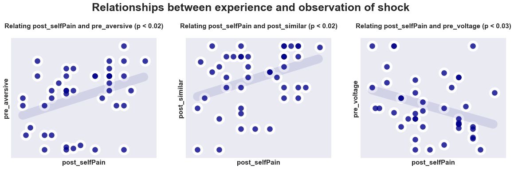
</p>


None of these self-report measures covary with any of the physiological measures on day one. 


<p align="center">
  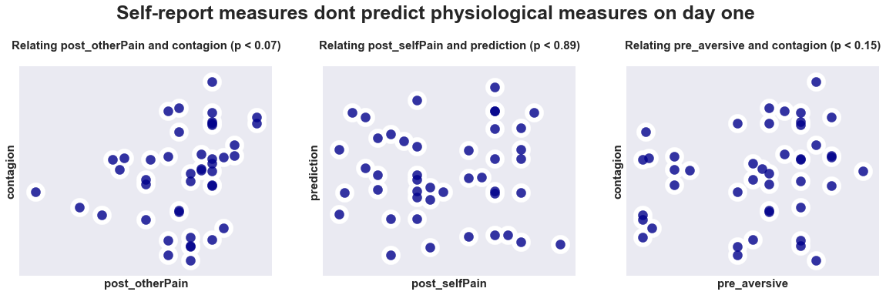
</p>


Additionally, we can look at the full covariance matrix of self-report and phsysiological (`contagion`, `prediction`, and `renewal`) and see that there is not much off-diagonal structure relating behavioral and physiological measures: 

<p align="center">
  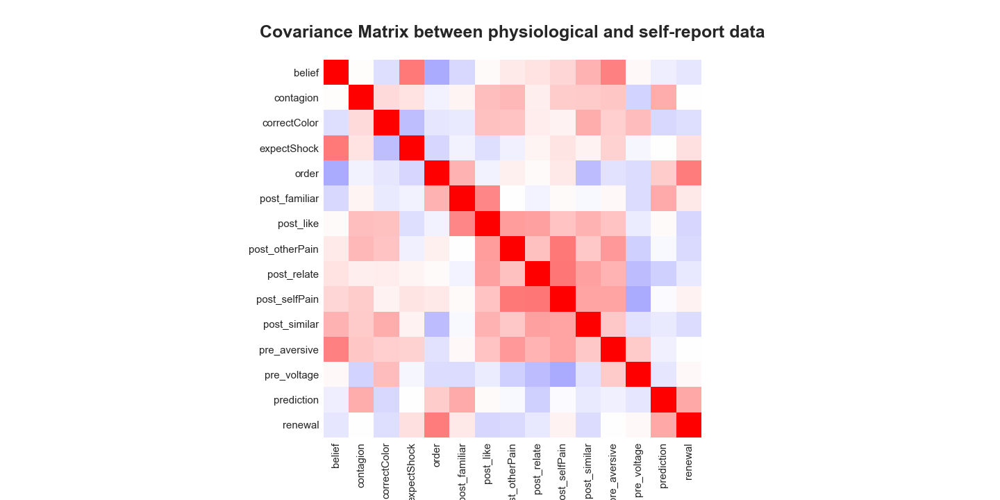
</p>

## Study one: psychological and physiological responses on day two

One day two, subjects were presented with the same stimuli used as CS+ on day one. First, we note a common effect of order of the magnitude of the skin conductance on day two: regardless of the stimulus type, the magnitude of the SCR is greater for the stimulus presented first across all subjects: 

<p align="center">
  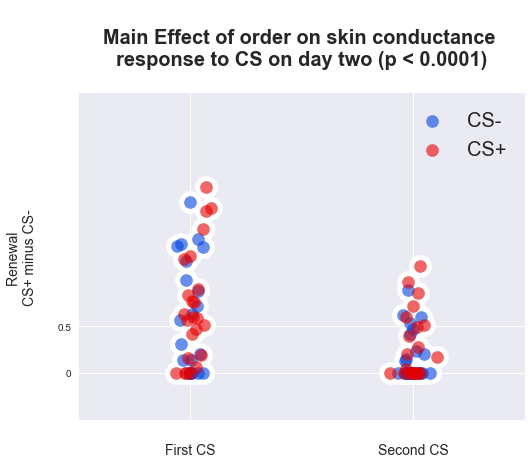
</p>

This is, however, an indiscriminate measure; it does not reflect differential learning that took place on day one. We can segment our analysis to look only at those subjects who showed differential learning on day one. In the analysese below, we refer to two measures of learning on day one. 

The first measure, which we refer to as **`contagion learning`**, makes explicit a common assumption in the emotional learning literature: that facial expressions are a priviledged stimulus which convey valenced information about environmental effects. If this is indeed the mechanisms for social learning, subjects who show differential skin conductance responses to the US (occuring at six CS+ offsets) should be those subjects that have learned the CS-US pairing. 

Conversely, if social learning occurs via the same mechanisms in place for first person experience, we would expect that learning on day one would be best characterized by subjects' differential skin conductance response to the CS+ at on ***onset*** of CS presentation. For clarity, we refer to this measure of learning as **`predictive learning`**. 

We show, first, that contrary to a common assumption in the literature, our measure of **`contagion learning`** does not accout for any variance in the physiological data on day two. 

as well as those subjects who showed differential emotional contagion on day one, at different threshholds: 

<p align="center">
  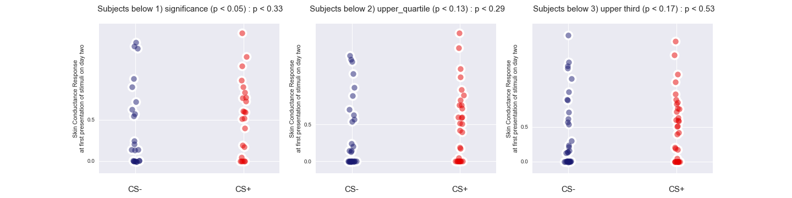
</p>


We show, first, that subjects whose skin conductance evidenced predictive learning showed significantly renewal on day two. This is true across as range of thresholds
 
<p align="center">
  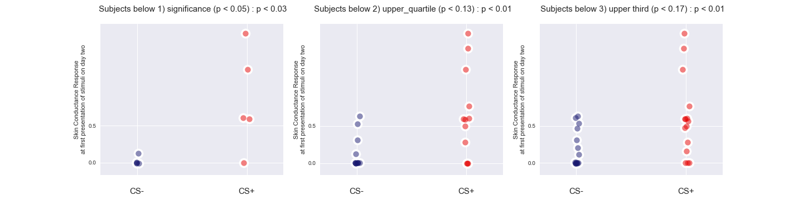
</p>


And, finally, we can show that there is a continuous relationship between predictive learning with renewal, but not emotional contagion:  

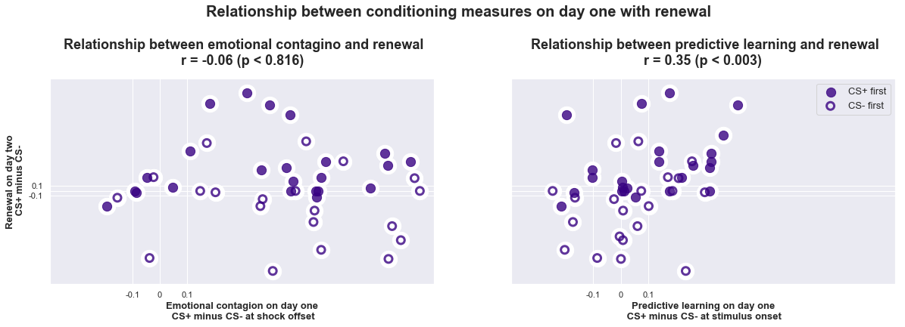

### Are there subjective experiences/self-report measures that predict this patter of phsysiolocal data? 

Only those subjects who report believing that the demonstrator was actually being shocked, on day one, reported expecting that they would be shocked on day two. 

<p align="center">
  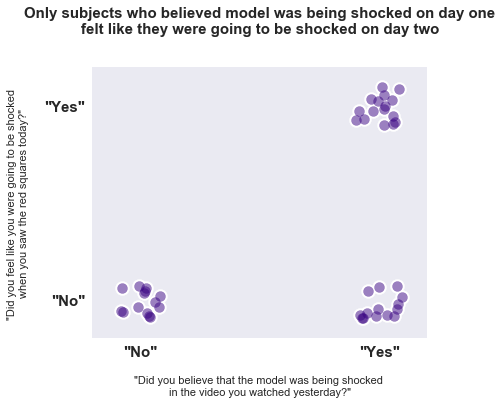
</p>

These behavioral measures, however, do not appear to predict renewal on day two. 

<p align="center">
  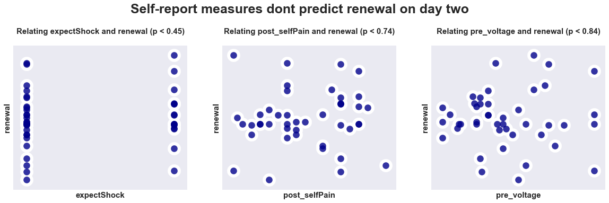
</p>


#Study two: replication + attentional measures


**```INCOMPLETE INCOMPLETE INCOMPLETE INCOMPLETE INCOMPLETE INCOMPLETE INCOMPLETE INCOMPLETE```**


**```
TODO
- build a calssifier that incorporates ALL the data into a prediction of renewal
- complete writeup
- incorporate trait data into study one```**

While there were no subjects who showed significantly differentially predictive responses to the CS+ on day one during conditioned, in this smaller cohort, looking across different statistical threshholds we observe the same pattern of evidence: predictive learning and not emotional contagion predicts renewal. 

First, we compare rates of renwal for subjects who differentially conditioned to the CS+ during conditionined via predictive learning: 

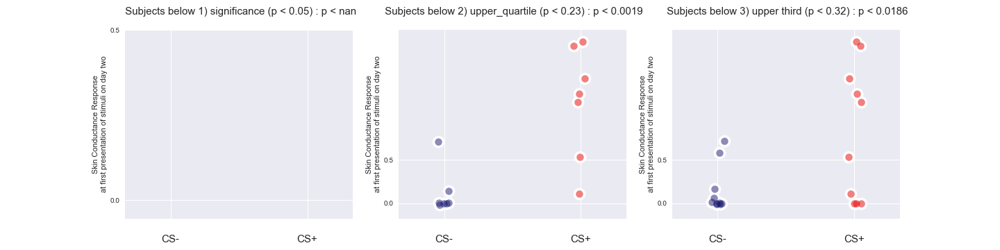

to rates of renewal for those same subjects who demonstrated dirrerential emotional contagion to CS+ on day one: 

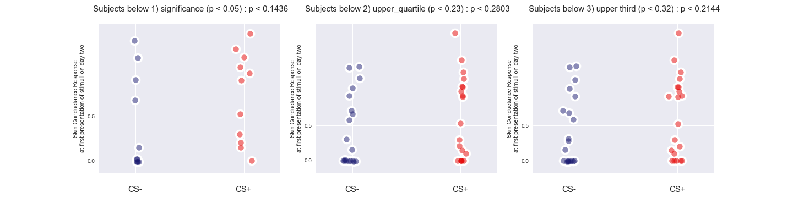

And again, we can look at the continuous relationship between these learning measures on day one with renewal:  

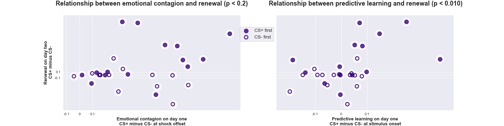

### Using eye-tracking data, we can ask: How does attention predict these patterns of physiological data? 

First, we observe that looking time at faces during shock covaries with many self-report measures of interest: 

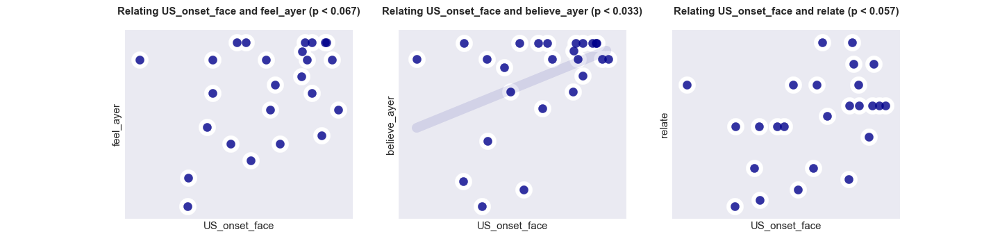

Yet this same measure does not predict our physiological measures of interest--and neither do a number of self-report measures that should, ostensibly, scale with learning about other's pain: 

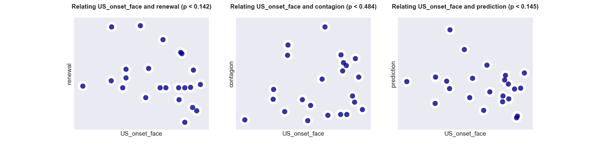
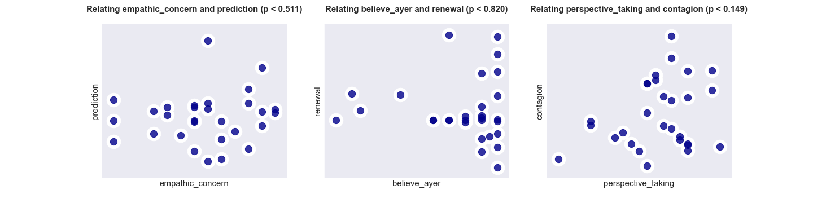

There are, however, other measures that do predict renewal: the amount of pain subjects report feeling at experiencing the shock themselves (```self_pain```), trait-level personal distress (```personal_distress```) as measured by the IRI, and looking time at the model's wrist, at the time of the US (```US_onset_wrist```): 


<p align="center">
  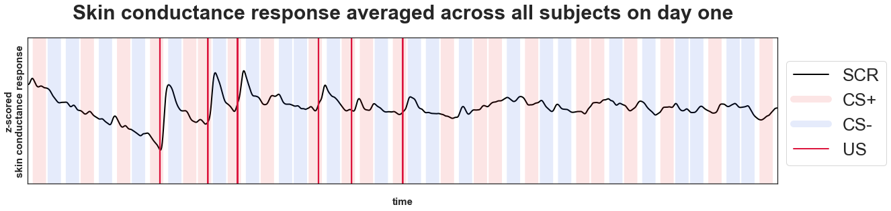
</p>


On day on, we asked subjects questions about their experience with a self-administered electrical shock: 
`'pre_aversive'`: "How uncomfortable was the shock that you just experienced?" (0-100)
`'pre_voltage'`: "What was the maximum voltage you administered shock to yourself?" (0-10)

as well as a number of questions after they observed a vido of another person being shocked during a social fear conditioning paradigm: 
`'correctColor'`: Did subjects learn that the correct color was associated with shock? 
`'post_familiar'`: "How familiar was the person you were watching in the video?" (0-100)
`'post_like'`: "How much did you like that person that was in the video?" (0-100)
`'post_otherPain'`: "How much pain did you think the person in the video was in?" (0-100)
`'post_relate'`: "How much did you relate to the person you were watching throughout the video?" (0-100)
`'post_selfPain'`: "How painful was it, for you, watching the person being shocked?" (0-100)
`'post_similar'`: "How similar was the person in the video to what you would have done?" (0-100)

On day two we asked question related to the day on video, as well as their subjective experience undergoing vicarious renewal: 

`'belief'`: "Do you believe that the person was being shocked in the video you were watching yesterday?" (yes/no) 
`'expectShock'`: "Did you think that you were going to be shocked" (day two, yes/no)

